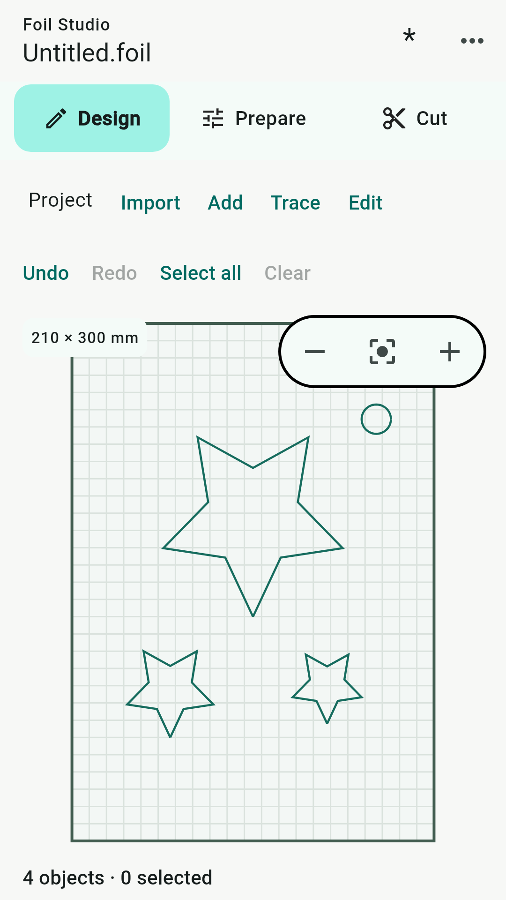

# Foil Studio

Design, prepare and send cutting projects to compatible GRBL plotters.

Foil Studio brings artwork editing, material and tool settings, and plotter control into a **Design → Prepare → Cut** workflow on Android.

- [User manual](docs/user-manual.md)
- [Screenshots](screenshots/README.md)
- [Privacy policy — draft pending publisher confirmation](PRIVACY.md)
- [Report an issue](https://github.com/plotter-doctor/Foil-Studio/issues)
- [Support and privacy contact](mailto:pratanczuk@gmail.com)

## Compatibility

Cutting requires a compatible physical plotter and firmware. Supported connection types are Bluetooth Classic serial (SPP), USB serial (CDC), and TCP. Bluetooth LE-only devices and vendor-specific proprietary protocols are not supported by these serial connections. Material loading and unloading require compatible firmware commands.

TCP is unencrypted and unauthenticated: use a trusted local network. Always supervise the plotter and check the work area before connecting or starting a job.

## About this repository

This public repository contains documentation and publication materials only. It does **not** contain the proprietary application source code, installable app, or signing credentials. Public visibility of these materials does not grant a licence to the application.

Screens show the current application rendered at phone size with independently created sample artwork. They are not photographs of a connected machine or evidence of hardware compatibility. Google Play availability will be linked here after release.
