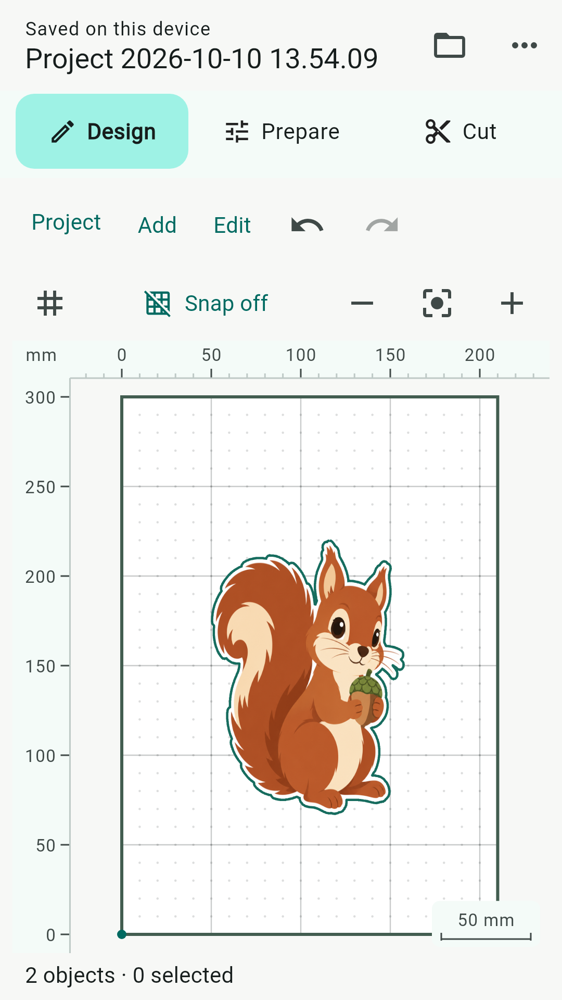
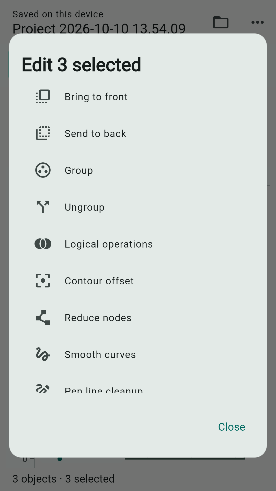
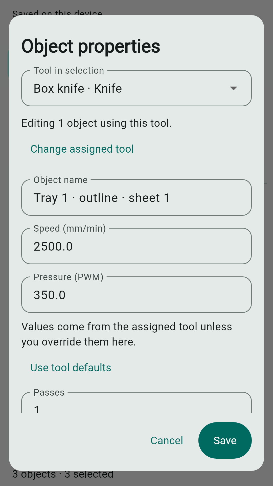
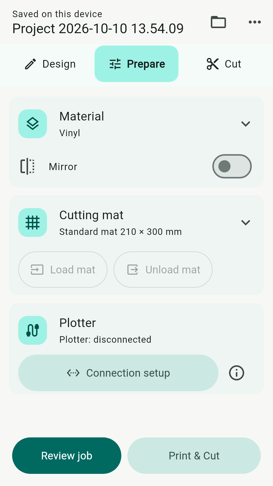
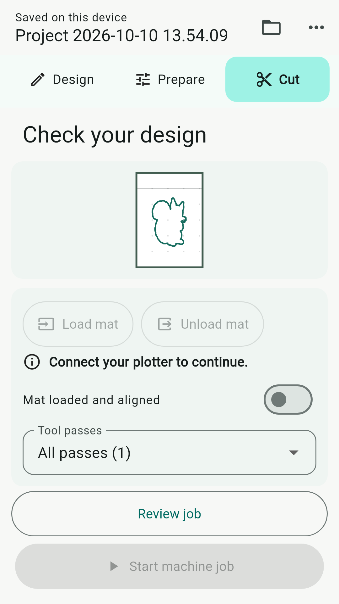
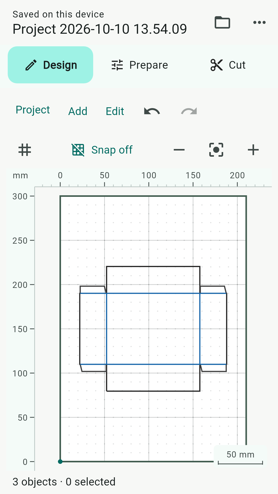

# Foil Studio user manual

Android 0.1.63 (67) · 10 October 2026

## Foil Studio

### Design → Prepare → Cut

Create or import artwork in Design. Choose your mat and connection in Prepare. Review the planned operations and start the machine from Cut. You can design without a plotter; cutting and drawing require compatible hardware.

### Start with a small project

Use Add → Rectangle, position it inside the mat, then select it and open Object properties. Check its named Knife tool, speed, pressure and passes. Open Prepare, connect the plotter and choose Review job. Follow the checks described on pages 5–6 before starting.

## Projects and artwork

### Save, open and back up

On Android, projects are saved in the device library. The header reports Saved on this device after saving finishes. Open the folder button or Project → Open to use My projects. Use the library's import action to bring in a project file. Export project creates a portable backup; keep a copy outside the app before clearing app data or replacing your device. Open JSON has been removed.

### Arrange overlapping objects

Select an object and long-press it to open its context menu. Bring to front and Send to back change the visual stacking order; the same actions are available in Edit and Object manager. Groups move together and Undo restores the previous order. Stacking changes do not change the tool execution priority.

## Tools belong to objects

### Choose the tool and process values

Select artwork, then open Object properties. New ordinary shapes start with a named Knife tool. Choose a different tool when needed. Speed (mm/min) and Pressure (PWM) initially come from the assigned tool; entering values here overrides them for these objects. Use tool defaults clears those overrides. Passes belongs to the object. Factory tool speeds start at 2500 mm/min; saved custom values are preserved.

### Edit composite artwork

For a box or multi-tool clipart, use Tool in selection to choose the members using each tool. Adjust that group's values or choose Change assigned tool. Switching groups retains your pending edits. Save applies them together; Cancel discards them. Printer and guide objects do not use machine pressure or passes. Materials no longer select tools or supply process settings.

## Create and refine designs

### Shapes, text and clipart

The Add menu offers shapes, text, freehand drawing, clipart and Box wizard. Browse clipart by collection and style, then size and position it on the mat. Cut, Pen and Print & Cut variants have different intended outputs: an outline, a drawing path, or printable artwork with a cut contour.

### Import drawings and images

Use Add → Import drawing for supported SVG or DXF files. Use Add → Import image for the image import and tracing workflow. Inspect the preview and dimensions before accepting. Fonts, embedded images and advanced SVG features may need adjustment after import. A successful import is not a guarantee that every external feature can be machined.

### Edit geometry

Use Edit to move, scale, rotate, align, duplicate or edit points. Object manager helps you select, rename, include or exclude objects that are difficult to reach on the canvas. Layers organize appearance and inclusion; machining values are edited on objects. Use Undo and Redo to review changes.

### Keep the job within the mat

The canvas supports editing beyond the mat, but off-mat geometry produces a warning and may prevent the intended job. Move or resize the artwork inside the usable work area before starting. Rulers, grid and snapping help placement; check the selected units whenever entering dimensions.

### Reusable artwork

Use the creative library to keep projects and reusable artwork on the device. Give entries recognizable names. Import/export lets you transfer your work; a device-local save is not a cloud backup.

## Prepare the job

### Material and mat

Material is a reference label only: changing it does not alter tools, speed, pressure or passes. Open the Material card to choose a reference or manage the Materials / Tools library. Check Mirror when the intended transfer workflow requires it. Open Cutting mat to choose or resize the mat. Confirm its dimensions match the usable machine area.

### Connection and review

Use Connection setup in the Plotter card. Load mat and Unload mat require a supported connection and compatible controller firmware. These commands move the machine; confirm the area is clear. Review job opens the Cut stage. Print & Cut is available for projects containing printer artwork. Small displays or larger accessibility text may still need scrolling in expanded panels.

## Run, stop and retry

### Check the actual operation order

Review the job and its tool stages before starting. Machine tool priority is Pen → Engraving → Scoring → Knife, so cutting is last. Within a tool kind, process ordering and grouping determine the stages; canvas stacking is independent. Printer artwork is printed separately and does not become a machine pass.

### Start only when ready

Load and align the mat, check Mat loaded and aligned, and inspect the chosen passes. Install the named first tool. Confirming Tool installed · Start begins motion. Follow later tool-change prompts. During drawing or cutting the progress label is In progress. Pressure is a controller PWM value, not a calibrated physical force; verify settings with your hardware and a small scrap test.

### After cancellation or a fault

Stop the job before changing the setup. Confirm the machine has stopped, inspect the mat and tool, and review the displayed status. A canceled job returns to a setup that can be prepared again; re-check mat alignment before restarting. Reconnection does not resume a job automatically. Do not repeatedly restart while the controller remains in Hold or Alarm.

## Make boxes

### Generate the net

Open Add → Box wizard. Choose the box style and enter finished dimensions, material thickness and fit clearance. Review fold treatment, tabs, placement and the generated sheets before creating the box. Select a generated box and use Edit → Box wizard / sheets to revisit its parameters or sheet selection.

### Set each operation

Generated cutting and folding members keep named tools. Open Object properties and choose Knife or Scoring in Tool in selection to adjust speed, pressure and passes independently. A perforated fold uses cutting segments; a scored fold uses the scoring tool. Check the preview and tool prompts. Make a prototype to verify fit, fold direction and material behavior before producing several copies.

## Printing and Print & Cut

### Print artwork

Assign Printer to printable objects, or use Print & Cut clipart that already contains printer artwork and a knife contour. The ordinary print workflow uses Android's print system. Review which objects are included and the page settings before sending output to your printer.

### Keep printed and cut dimensions consistent

Print at the intended physical scale. Printer margins and automatic Fit to page can change placement or size. Check a known measurement on the printout before cutting. Keep the printed sheet orientation consistent with the mat preview.

### Align Print & Cut manually

Open Print & Cut from Prepare for a project containing printer artwork. Follow the registration and alignment steps in the app before cutting the contour. This workflow uses manual alignment; it is not automatic camera registration. Recheck alignment whenever the sheet or mat moves.

### Edit a composite safely

Printable appearance and the machine contour are separate members of the composite. Select the group and use Tool in selection to inspect Printer and Knife independently. Change the Knife settings without converting the printed artwork into a machine path. Keep the group together when resizing or moving the design.

### Troubleshoot an offset contour

Stop and check print scaling, sheet orientation, mat placement and alignment. A correct on-screen contour cannot compensate for an incorrectly scaled printout. Test one small item before repeating a whole sheet.

## Connect and troubleshoot

### Supported connections

Connection setup supports Bluetooth Classic serial (SPP), USB serial (CDC), and TCP for compatible GRBL-based controllers. Availability depends on the phone, adapter, plotter and firmware. BLE-only devices and proprietary plotter protocols are not supported by these serial transports. Use TCP only on a trusted local network; it has no authentication or encryption.

### Auto-connect and idle behavior

After configuring a supported remembered connection, enable Auto-connect in Connection setup if you want reconnection attempts. An idle link is retained when opening app dialogs or switching briefly to the Android desktop. Auto-connect attempts only occur while the app is in the foreground. Manual Disconnect suppresses immediate reconnect. Failed attempts eventually require a manual Connect.

### If the connection drops

Check plotter power, cable or Bluetooth range, the selected device and Android permissions. Return to the app and inspect the connection status. Connect again if needed. Auto-connect does not unlock alarms or resume motion; inspect the interrupted setup before starting a new job. Phone power management and hardware faults can still interrupt a link.

### If Start is disabled

Read the message in Cut. Confirm connection, controller readiness, included geometry, tool assignments, usable mat bounds and Mat loaded and aligned. Review job to inspect planned stages. Resolve the reported condition before trying again.

### When reporting a problem

Record the app version, connection type, plotter/controller firmware, the exact visible message and the steps leading to it. Include a screenshot and a small exported project when possible. Never include passwords or private network credentials. This manual describes version 0.1.63; older dated manuals are historical.
