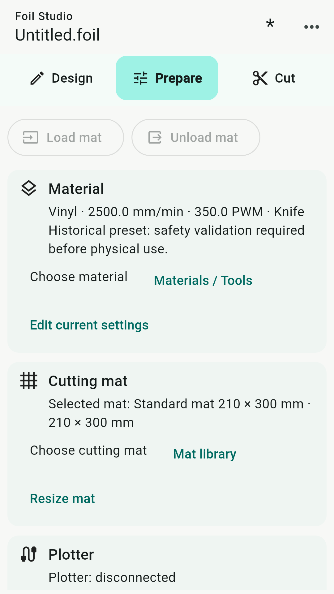
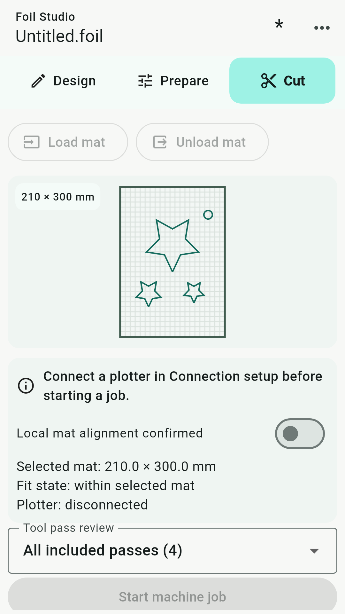

# Foil Studio user manual

Android · English · Prepared 28 September 2026 · App 0.1.0

[Home](../README.md) · [Screenshots](../screenshots/README.md)

## 1. Before you begin

You need a compatible GRBL-based plotter, suitable material, and the correct tool. Connection and loading features depend on your plotter firmware. Do not assume compatibility with a machine simply because it has Bluetooth or USB.

Keep hands clear of moving parts. Verify blade exposure, material attachment, and travel clearance. Supervise every job. Use the plotter's physical stop or power control if motion is unsafe; an on-screen control depends on the connection.

**Connecting can cause motion:** the app may resume an initial fully held controller once while connecting. Make sure no unwanted interrupted job remains queued before connecting.

## 2. Your first project

1. In **Design**, use **Add** to create a shape, text, clipart, or freehand drawing.
2. Position the artwork inside the cutting mat. Start with a small, simple test design.
3. Save the project from **Project** to a location you can find again.
4. In **Prepare**, choose the physical mat, material, and tool. Review current pressure and speed.
5. Open **Connection setup** and connect to your plotter.
6. Load and physically align the mat. Use **Load mat** only if your firmware supports it.
7. Select **Review job**. In **Cut**, inspect the preview and included tool passes.
8. Confirm local mat alignment only after checking the physical setup.
9. Start the machine job. Install the requested tool and confirm the tool prompt before motion starts.
10. Supervise the job. Follow any subsequent tool-change prompts. At completion, follow the unload prompt.

The defaults are a **210 × 300 mm** mat and **Vinyl**, with pressure **350**, speed **2500 mm/min**, and a **30° drag knife**. Pressure is a controller/PWM value, not a calibrated force in grams. These are starting settings, not a guarantee for every machine or vinyl. Test and adjust on scrap material first.

## 3. Design

### Select, move and view

- Tap an object to select it. Tap empty mat space to clear selection.
- Drag from an empty area to draw a selection rectangle.
- Use two fingers to pan or zoom the mat; this changes the view, not the physical mat dimensions.
- Use the canvas view controls to adjust or fit the view.
- Use **Undo** and **Redo** to correct edits.

### Add artwork

Use **Add** for text, geometric shapes, **Clipart library**, and **Freehand**. In Freehand mode, lift your finger to finish a stroke; no separate stroke confirmation is needed. Exit drawing mode when you want to select objects again.

Use **Import** for supported vector/project inputs, or **Trace** to turn an image into paths. Import support is format-dependent: check the result for missing shapes, scale, duplicate lines, and unwanted contours. A camera or imported image may need simplification before it is suitable for cutting.

### Edit and prepare shapes

Select the intended objects before opening **Edit**. Available tools include transformations, alignment, path/node editing, and geometric operations. Some commands require closed paths or a particular selection. Read the validation message if an operation cannot be applied.

For union or subtraction, start with simple overlapping closed shapes and inspect the result before cutting. Open strokes, self-intersections, or tiny details can give unsuitable output. Undo if the resulting geometry is not what you intended.

Weeding frames and lines divide waste material into manageable sections. Use clearance around delicate artwork, inspect the preview, and ensure relief cuts do not cross parts you want to keep. Contour offsets and layout tools also need a preview check before applying. Do not rely on automatic placement alone to establish safe cutting clearance.

### Layers and tools

Open **Edit → Layers**. Layer colours identify artwork visually; they are not pressure values. Checked layers are included in the job.

To assign objects, select them on the mat, open Layers, and choose **Move selection here** on the destination layer. Use **Edit layer** for its properties and colour, and **Choose tool** for its tool. Expand **Objects in this layer** to inspect its contents. Review the job again after changing layers or tools.

## 4. Prepare

**Material:** choose a preset or open **Materials / Tools** to manage your library. **Edit current settings** changes the active job setup; do not assume it updates a saved preset. Review pressure, speed, and tool before each job.

**Cutting mat:** choose the mat matching the physical mat. The default is 210 × 300 mm. Use **Mat library** to manage presets. Resizing a virtual mat does not resize or reposition the physical material.

**Plotter:** open connection setup, check the reported status, and inspect any warning before continuing. Use **Review job** after changing artwork, mat, material, or tool settings.

### Bluetooth

1. Pair the plotter in Android's Bluetooth settings first.
2. Open the Bluetooth tab in connection setup. The list refreshes when entering the tab.
3. Allow the requested Nearby devices permission and select the paired plotter.
4. Connect and wait for a controller status.

The connection requires Bluetooth Classic SPP. A BLE-only device will not work through this connection type.

### USB

1. Connect a supported USB CDC serial controller using a data-capable cable and an appropriate phone adapter.
2. Open the USB tab; the device list refreshes automatically.
3. Select the device, allow Android's device permission prompt, and connect.

Not every USB-to-serial chipset is supported. A charge-only cable cannot provide a serial connection.

### TCP / Wi-Fi

Connect the phone and plotter to a trusted reachable local network. Enter the plotter's host name or IP address and its listening port. The defaults are **plotter.local** and **8888**. If local hostname discovery is unavailable, enter the controller's actual IP address.

TCP carries controller commands without authentication or encryption. Do not expose the port to the public Internet or use an untrusted network.

### Load and unload the mat

On compatible firmware, **Load mat** sends `$LOAD_MATERIAL=<distance>` and **Unload mat** sends `$UNLOAD_MATERIAL`. The default loading distance in settings is **20 mm**. Adjust it for the actual machine; it is not the same as mat height.

Loading establishes the working Y origin for the loaded mat. Check the physical position before confirming alignment. If the firmware rejects these commands, stop and verify compatibility rather than assuming ordinary jogging is equivalent.

## 5. Cut

The preview and tool-pass list let you check what will be sent. A disconnected plotter cannot start a job. A preview is not proof that the blade depth, pressure, firmware, or physical alignment is correct.

Confirm alignment, then start the job and confirm the first-tool popup. For multi-tool jobs, wait for the tool-change prompt and for motion to stop before touching the carriage. Fit the requested tool and confirm to continue.

Before a tool change and after completion, the app turns the tool off and returns **X only to working X=0**. This is not a full machine homing cycle and does not home Y. Completion prompts you to unload the mat.

Keep the app in the foreground during a job. Leaving the app or losing the connection can interrupt communication. Do not blindly restart a partially completed job: inspect the machine, remaining material, and position first.

## 6. Projects and local data

Save important work explicitly through the Project menu. Android's document picker lets you choose a local folder or a document provider you have installed. A cloud-backed provider may synchronise files under its own settings.

Local recovery is not a substitute for exported backups. Clearing application data or uninstalling can remove private workspace data and settings. Files you exported elsewhere must be managed separately.

## 7. Troubleshooting

| Symptom | Check |
| --- | --- |
| Bluetooth device missing | Pair it in Android, enable Bluetooth, allow Nearby devices, and verify Classic SPP support. |
| USB device missing | Try a data cable/adapter, approve USB access, and verify CDC support. |
| TCP cannot connect | Verify the IP/hostname, port, local network, and whether another client already occupies the controller. |
| Hold remains active | Check the controller and interrupted-job state. Initial connection recovery is not an instruction to resume every later Hold. |
| Alarm or error | Read the reported cause. Use recovery only after resolving it; resetting or unlocking may require physical realignment. |
| Load/unload rejected | Verify firmware support for the dedicated material commands and the configured load distance. |
| Start disabled | Check connection, controller status, current job review, included layers, and alignment confirmation. |
| Job starts in the wrong place | Stop, check material loading and working origin, then realign and review again. |
| Preview changed or review invalidated | Artwork or settings changed. Review the job again before starting. |
| Geometry operation fails | Check selection, closed paths, overlap, and invalid/self-intersecting geometry. |

## 8. Help

For support or privacy questions, email [pratanczuk@gmail.com](mailto:pratanczuk@gmail.com). Do not send passwords or payment-card details.

Report reproducible problems in [GitHub Issues](https://github.com/plotter-doctor/Foil-Studio/issues). Include app version, phone/Android version, controller and firmware, connection type, steps to reproduce, and the exact error. Do not post personal projects, passwords, purchase details, private network addresses, or other sensitive information publicly. Use a small non-sensitive sample where possible.
