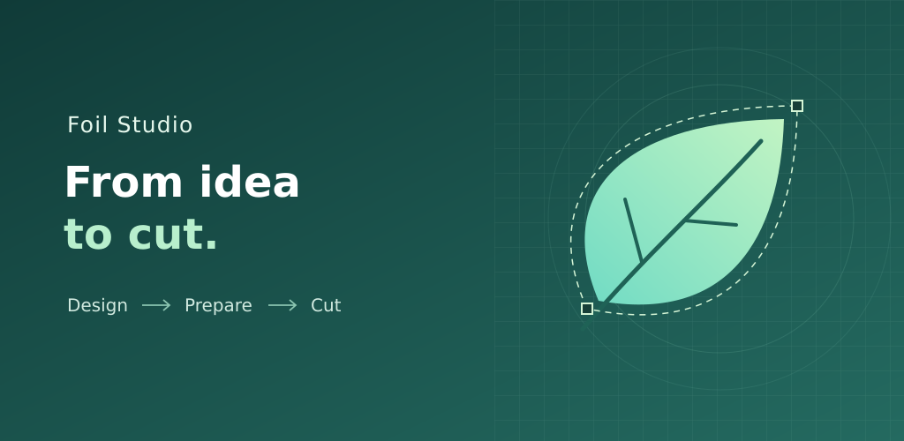

# Google Play assets

Original vector artwork, prepared 28 September 2026. The icon matches the application's existing teal-and-white F launcher mark. The feature graphic extends the same palette with independently authored cutting-path artwork; it is not a screenshot or a promise of a particular physical result.

- `icon-512.png`: 512 × 512, RGBA PNG; store icon.
- `feature-1024x500.png`: 1024 × 500, RGB PNG; feature graphic.
- Editable SVG sources are included. They are graphic assets, not application code.

Feature graphic alt text: **Foil Studio: From idea to cut. A leaf-shaped cutting path illustrates the Design, Prepare, Cut workflow.**

Icon alt text: **White F on the teal Foil Studio background.**

Typography: DejaVu Sans. Graphics use no third-party photographs, device mockups, or customer artwork. These materials do not grant a licence to the proprietary application.

